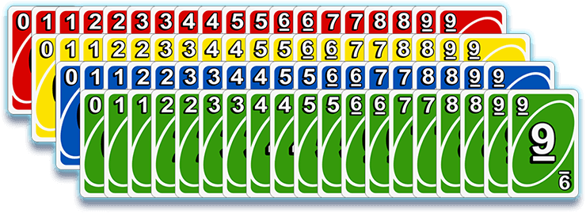
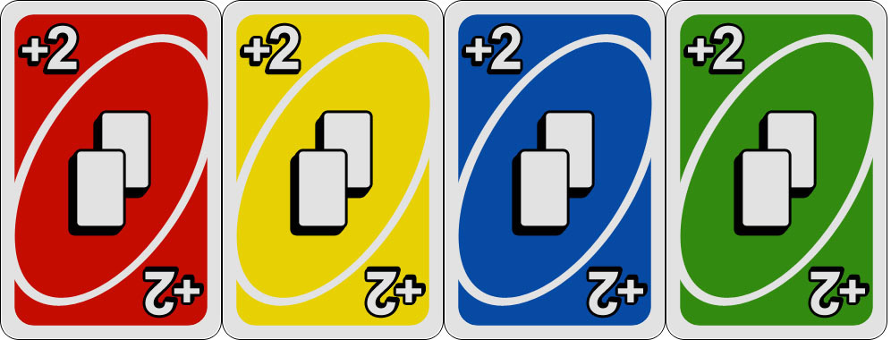
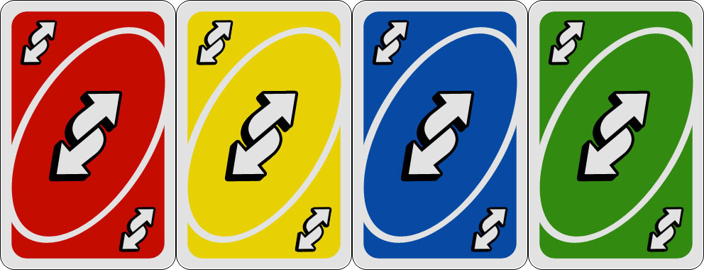
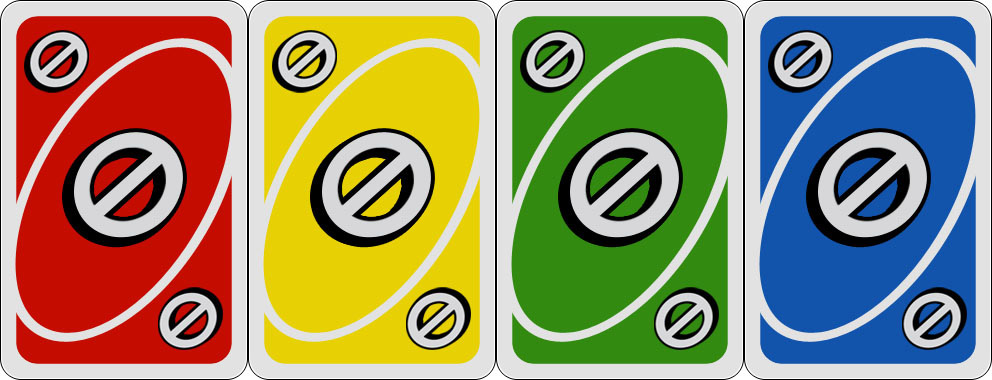

# Uno
### Pravila  
***Svaki igrač dobija po 7 karata.*** Ostale karte se okreću licem prema dolje i stavljaju na "hrpu" (hrpa za uzimanje karata). Gornja karta sa hrpe za uzimanje karata se okreće i stavlja pored hrpe za uzimanje karata i čini osnovu hrpe izbačenih karata. Prvi igrač bira kartu iz ruke, ali tako da se ona mora slagati sa kartom na vrhu hrpe izbačenih karata po broju, boji ili značenju. Prvi igrač stavlja kartu na vrh hrpe izbačenih karata i sljedeći igrač izbacuje kartu tako da se ona slaže sa kartom prethodnog igrača. Ako, u nekom trenutku, igrač ne može odigrati ni jednu od svojih karata, mora uzeti jednu kartu sa hrpe za uzimanje karata, koju može izbaciti ako se ona slaže sa prethodnom po broju, boji ili značenju. Karte sa specijalnim značenjem čine igru zanimljivijom: npr. okretanjem smjera igre, preskakanjem igrača koji igra ili zahtjevom da idući igrač vuče određeni broj dodatnih karata.
 
Komplet karata za igru UNO čini *108 karata* i to: 
- 19 karata sa brojevima 0-9 u plavoj boji 
- 19 karata sa brojevima 0-9 u crvenoj boji 
- 19 karata sa brojevima 0-9 u žutoj boji 
- 19 karata sa brojevima 0-9 u zelenoj boji   

- 8 karata sa oznakom +2 (Draw Two); po 2 u svakoj boji 
- 8 karata za okretanje smjera igre (Reverse); po 2 u svakoj boji 
- 8 karata za preskakanje igrača koji je na redu za igru (Skip); po 2 u svakoj boji 
- 4 karte za promjenu boje (Wild) 
- 4 karte sa oznakom Wild Draw Four  

### Dijeljenje  
Djelitelj započinje igru djeljenjem po 7 karata svakom igraču i odabirom prve pocetne karte. Igra se nastavlja tako što svaki igrač baca kartu koja se slaže sa prethodnom po broju ili boji, ili tako što igrač prati uputstva sa karte prethodnog igrača. Ako tijekom igre igrač ne može odigrati ni jednu od svojih karata, mora uzeti jednu kartu sa hrpe za uzimanje karata, koju može izbaciti ako se ona slaže sa prethodnom po broju, boji ili značenju. Ako i poslije izvlačenja karte igrač ne može odigrati, na potezu je sljedeći igrač. 

### KARTE SA SPECIJALNIM ZNAČENJEM
#### DRAW TWO

Kad se odigra ova karta, sljedeći igrač vuče 2 karte i preskače svoj red za igru. Ne može se poništiti značenje ove karte bacanjem druge Draw Two karte. Kad netko baci ovu kartu, sljedeći  igrač mora uzeti dvije karte i preskočiti svoj red za igru.  

#### REVERSE

Odigravanjem ove karte se okreće smjer igre, dok se ne odigra druga Reverse karta.  

#### SKIP

Odigravanjem ove karte "preskače" se sljedeći igrač. Ne može se poništiti efekt Skip karte bacanjem druge Skip karte. Nakon što igrač povuče dvije karte ili je preskočen, sljedeći igrač može igrati neku od specijalnih karata u istoj boji, bilo koju kartu u boji te karte sa specijalnim značenjem, ili odigrati Wild kartu. Nakon igranja Reverse karte, sljedeći igrač u novom smjeru može opet odigrati Reverse kartu i tako vratiti smjer igre u prethodni.  

##### WILD

Ove karte mogu biti odigrane na bilo koju boju ili tip karte. Igrač koji baci ovu kartu, može  promijeniti boju koja se igra ili odlučiti nastaviti sa tekućom bojom. Odigravanje ove karte ne poništava efekt prethodno odigranih karata sa specijalnim značenjem, niti ima drugog efekta na sljedećeg igrača, osim promjene boje igre. Wild kartu igrač može odigrati čak i ako ima druge karte koje može odigrati. Ova karta ne mora biti odigrana prije Wild Draw Four karte, kako bi promjenila boju, jer Wild karta nema boju dok je pozove igrač koji je bacio ovu kartu. 
*Primjer: Odigrana je crvena petica. Igrač ima u ruci crvenu četvorku, plavu peticu, crvenu Reverse i Wild kartu. Iako ima karata u crvenoj boji, igrač može baciti Wild kartu i odrediti boju koja će se dalje igrati.* 
**Ne postoje ograničenja u odigravanju Wild karte!**  

#### WILD DRAW FOUR

Odigravanje ove karte ne samo da daje pravo igraču da odredi boju kojom će se igra dalje nastaviti, nego i primorava sljedećeg igrača da uzme 4 karte iz kompleta za uzimanje karata i preskoči svoj red za igru. Wild Draw Four karta može biti odigrana samo kada igrač među kartama u ruci nema niti jednu kartu u traženoj boji. Dozvoljeno je da igrač ima kartu sa odgovarajućim brojem, ali različite boje, i da odigra Wild Draw Four kartu.  

### ZAVRŠETAK IGRE  
Kad igrač odigra posljednju od svojih karata, tada se završava igra. U slučaju da nitko od igrača ne završi do trenutka kada se potroše sve karte iz hrpe za uzimanje karata, uzima se hrpa za izbacivanje karata (osim gornje karte), koja se miješa i zatim stavlja kao nova hrpa za uzimanje karata. Pobjednik je igrač koji prvi izbaci sve karte iz ruke.
